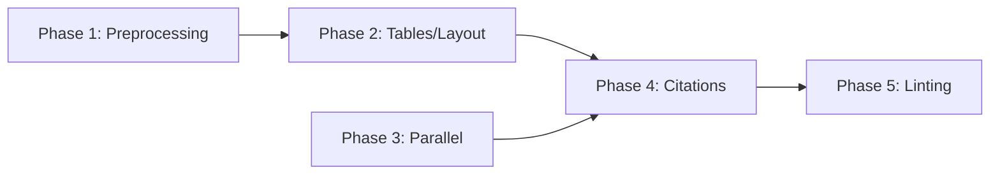

# Enhanced PDF Processing for Learning

## Overview

Enable OpenKB to process large PDF textbooks (~200k tokens, 400-500 pages) for learning purposes. Current LLM API calls **fail** on large books due to context overflow. This plan adds preprocessing, table/layout extraction, parallel compilation, cross-book citations, and enhanced linting.

**Key decision:** Use `pymupdf4llm` library for PDF conversion — it already handles table extraction, multi-column layouts, and page chunking. Replaces fragile manual `convert_pdf_with_images()` code.

**User priority:** Quality over speed. Results must be good; time is not a constraint.

## Phases

| Phase | Name | Status | Priority | Effort | Dependencies |
|-------|------|--------|----------|--------|--------------|
| 1 | [PDF Preprocessing Pipeline](./phase-01-pdf-preprocessing-pipeline.md) | Completed | P1 | 3d | Completed |
| 2 | [Table and Layout Extraction](./phase-02-table-and-layout-extraction.md) | Completed | P1 | 2d | Completed |
| 3 | [Parallel Document Compilation](./phase-03-parallel-document-compilation.md) | Completed | P2 | 2d | None |
| 4 | [Cross-Document Citations](./phase-04-cross-document-citations.md) | Completed | P1 | 3d | Phase 2 |
| 5 | [Semantic Linting Enhancement](./phase-05-semantic-linting-enhancement.md) | Completed | P2 | 2d | Phase 4 |

## Dependencies

## Key Architecture Decisions

1. **pymupdf4llm** replaces manual `convert_pdf_with_images()` for PDF conversion
   - Handles tables via `find_tables()` → markdown
   - Handles multi-column layout detection
   - Provides `page_chunks=True` for per-page extraction
   - Image extraction with configurable output paths

2. **Chapter-aware splitting** via `doc.get_toc()` (bookmarks)
   - Fallback to fixed-size chunks when no TOC
   - Each segment processed as a "short doc" through existing pipeline

3. **Compile batch** pattern with `asyncio.Semaphore`
   - Document-level parallelism (not just concept-level)
   - Post-compilation concept merge for duplicates

4. **Structured citations** in YAML frontmatter
   - `citations: [{book, pages, chapter}]`
   - Query agent instructions enforce inline source attribution

## Success Metrics

1. Books 400+ pages compile without API errors
2. Tables render as markdown tables (not flat text)
3. 2-column layouts produce correct reading order
4. Multiple books compile in parallel
5. Concept pages show source attribution
6. Lint reports include severity levels

## Reference

- [Brainstorm Report](./brainstorm-report.md)
