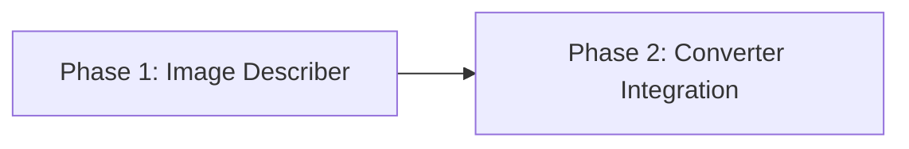

# Image Description During Compile

## Overview

Images extracted from PDFs are never analyzed by LLMs during compilation. This plan adds a pre-processing step that calls VLM on each image and injects text descriptions into markdown before the compilation pipeline runs.

**Key decision:** Pre-processing approach — enrich markdown text BEFORE compilation. No compiler changes needed.

**User priority:** Quality over speed. Use most capable vision model.

## Phases

| Phase | Name | Status | Priority | Effort | Dependencies |
|-------|------|--------|----------|--------|--------------|
| 1 | [Implement Image Describer](./phase-01-implement-image-describer.md) | Completed | P1 | 4h | - |
| 2 | [Integrate into Converter Pipeline](./phase-02-integrate-into-converter-pipeline.md) | Completed | P1 | 2h | Phase 1 |

## Dependencies

## Key Architecture Decisions

1. **Pre-processing** — describe images, inject into markdown, THEN compile
2. **litellm** for VLM calls — consistent with existing model config
3. **Image + description** — keep image link, add `*[Figure: ...]*` below
4. **Graceful failure** — VLM errors logged, image left without description

## Success Metrics

1. ✅ Images in PDFs get VLM-generated descriptions injected into markdown
2. ✅ Descriptions flow into summaries and concepts via existing pipeline
3. ✅ VLM call failures don't break compilation
4. ✅ Feature is toggleable via config

## Completion Summary

**Status:** COMPLETED
**Tests:** 284/284 passing
**Code review fixes applied:**
- Path traversal guard (critical security fix)
- Image size limit (20MB cap)
- max_images limit (configurable, default 50)
- VLM response sanitization (strip newlines/markdown)
- Config parameter passed to convert_segment
- Model prefix simplification

**Implementation:**
- `openkb/image_describer.py` — VLM image description service
- `openkb/converter.py` — integrated image description into pipeline
- `openkb/cli.py` — `--describe-images` flag added
- Full test coverage for all new functionality

## Reference

- [Brainstorm Report](./brainstorm-report.md)
